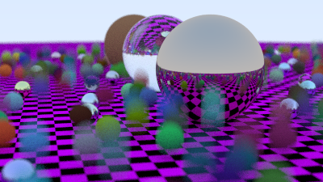
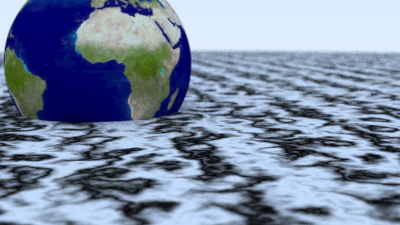
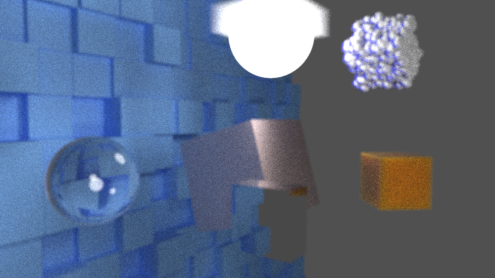

# Ray-Tracing

## Sample scene 1:

> 400x225, 100 samples per pixel, 50 max ray bounce depth

## Sample scene 2:

> 400x225, 100 samples per pixel, 50 max ray bounce depth

## Sample scene 3:

> 400x225, 100 samples per pixel, 50 max ray bounce depth

## Sample scene 4:

> 1000x562, 500 samples per pixel, 50 max ray bounce depth

## CUDA Accelerated Ray Tracer
If you wish to use the CUDA accelerated version, make sure you install NVCC

## Credits:
[_Ray Tracing in One Weekend_](https://raytracing.github.io/books/RayTracingInOneWeekend.html)

[_Ray Tracing: The Next Week_](https://raytracing.github.io/books/RayTracingTheNextWeek.html)